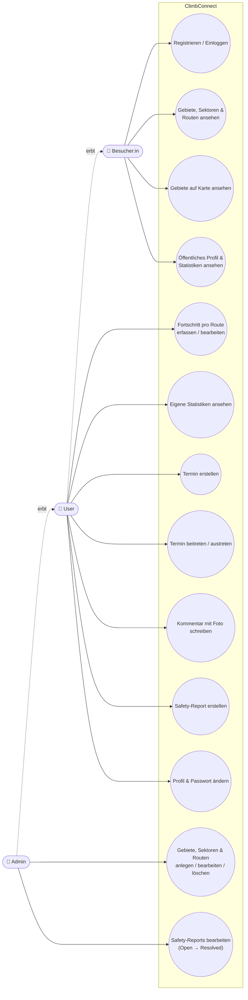
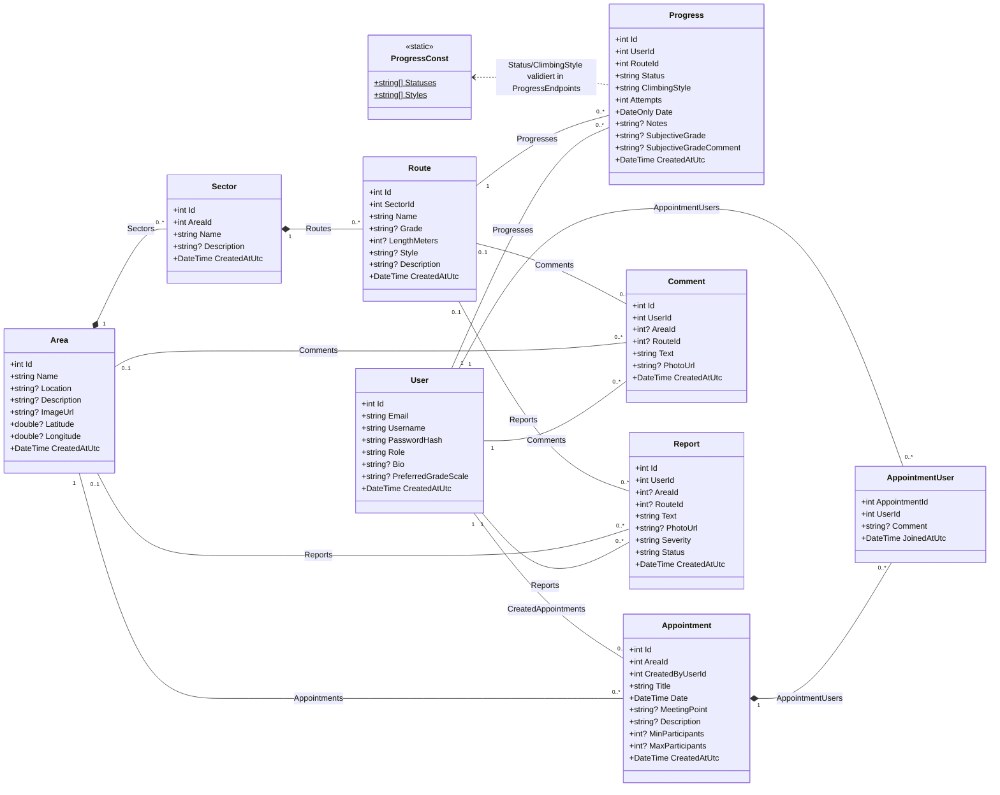
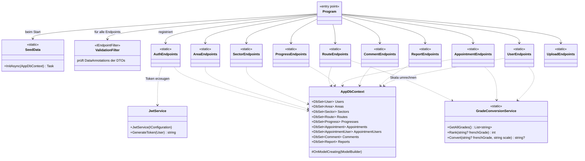
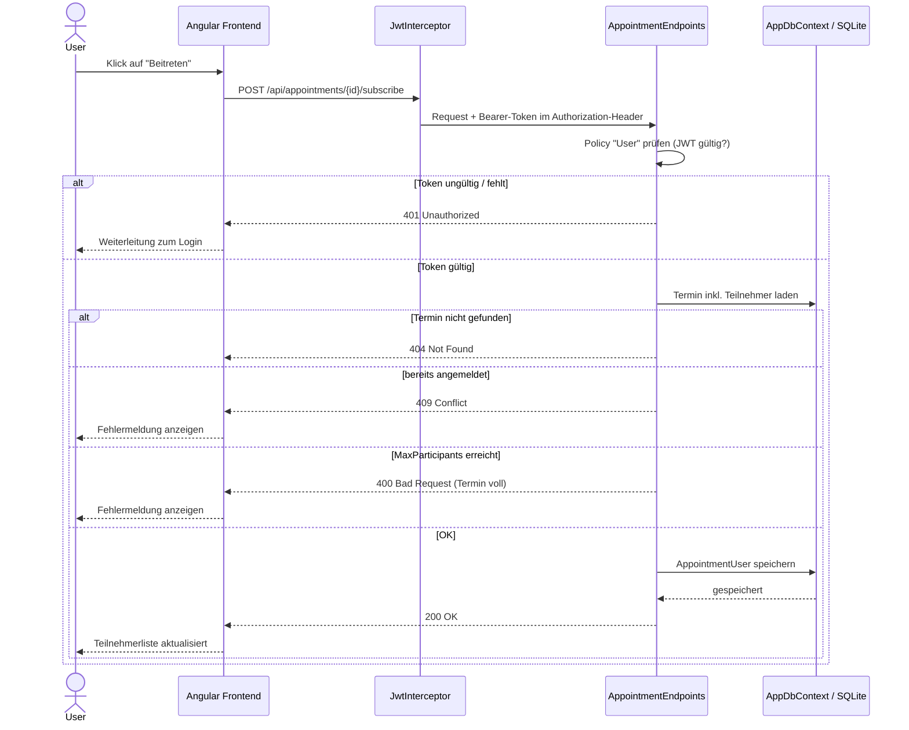

# UML-Diagramme – ClimbConnect

Diese Datei enthält:

1. [Use-Case-Diagramm](#1-use-case-diagramm) – wer kann was im System?
2. [Klassendiagramm](#2-klassendiagramm-domain-model) – Entity-Klassen aus `backend/ClimbConnect.API/Models`
3. [Klassendiagramm Backend-Struktur](#3-klassendiagramm-backend-struktur) – Endpoints, Services, DbContext
4. [Sequenzdiagramm](#4-sequenzdiagramm-einem-termin-beitreten) – Ablauf „Einem Termin beitreten“

Alle Diagramme sind in Mermaid geschrieben und werden direkt auf GitHub gerendert.

---

## 1. Use-Case-Diagramm

Akteure:
- **Besucher:in**: nicht eingeloggt
- **User**: eingeloggt, erbt alle Rechte des Besuchers
- **Admin**: erbt alle Rechte des Users

| Use Case | Akteur | API-Endpunkt(e) |
|---|---|---|
| Registrieren / Einloggen | Besucher:in | `POST /api/auth/register`, `POST /api/auth/login` |
| Gebiete, Sektoren & Routen ansehen | Besucher:in | `GET /api/areas`, `GET /api/areas/{id}/sectors`, `GET /api/sectors/{id}/routes`, `GET /api/routes/{id}` |
| Öffentliches Profil ansehen | Besucher:in | `GET /api/users/{id}/profile`, `GET /api/users/{id}/stats` |
| Fortschritt erfassen | User | `POST/PUT/DELETE /api/progress`, `GET /api/progress/me` |
| Termin erstellen | User | `POST /api/areas/{id}/appointments` |
| Termin beitreten / austreten | User | `POST/DELETE /api/appointments/{id}/subscribe` |
| Kommentar schreiben | User | `POST /api/areas/{id}/comments`, `POST /api/routes/{id}/comments`, `POST /api/upload` |
| Safety-Report erstellen | User | `POST /api/reports` |
| Profil & Passwort ändern | User | `PUT /api/users/me/profile`, `PUT /api/users/me/password` |
| Gebiete/Sektoren/Routen verwalten | Admin | `POST/PUT/DELETE` auf `/api/areas`, `/api/sectors`, `/api/routes` |
| Safety-Reports bearbeiten | Admin | `GET /api/reports`, `PUT /api/reports/{id}/status` |

---

## 2. Klassendiagramm (Domain Model)

**Hinweise**
- Komposition (◆) bei `Area → Sector → Route` und `Appointment → AppointmentUser`: Wird das Ganze gelöscht, verschwinden die Teile mit.
- `Comment` und `Report` hängen **entweder** an einem Gebiet **oder** an einer Route (daher `0..1`).

---

## 3. Klassendiagramm Backend-Struktur

Aufbau der .NET 8 Minimal API: Jede Endpoint-Gruppe ist eine statische Extension-Klasse, die in `Program.cs` registriert wird.

---

## 4. Sequenzdiagramm: Einem Termin beitreten

