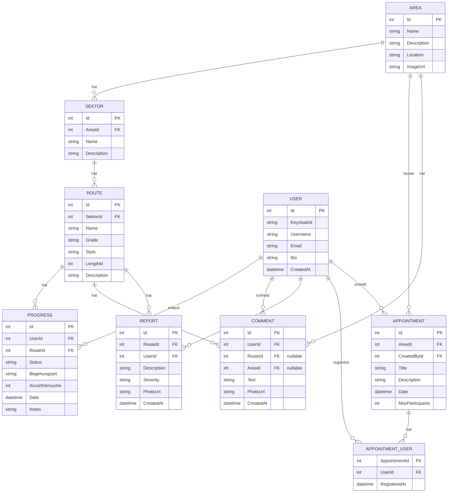

# ER-Diagramm – ClimbConnect (v2)

## Änderungen gegenüber v1

| Was | Warum |
|---|---|
| `SEKTOR` neu zwischen Area und Route | Laut ABA-Portal: "Sektoren, Routen, Schwierigkeitsgrade" |
| `Route.SektorId` statt `AreaId` | Route gehört zu einem Sektor, nicht direkt zum Gebiet |
| `Progress.Begehungsart` (Toprope/Vorstieg) | Explizit im ABA-Portal erwähnt |
| `Progress.AnzahlVersuche` | "benötigte Versuche" laut ABA-Portal |
| `Progress.Status` = Projekt/Rotpunkt/Flash/Onsight | Standard-Kletterterminologie |
| `Comment.RouteId` + `Comment.AreaId` nullable | Kommentare zu Gebieten ODER Routen möglich |
| `Comment.PhotoUrl` | "Bilder zu Gebieten/Routen" laut ABA-Portal |
| `User.KeycloakId` statt `PasswordHash` | Auth via Keycloak, kein eigenes Passwort |

## Enums

**Progress.Status:** `Projekt` · `Rotpunkt` · `Flash` · `Onsight`

**Progress.Begehungsart:** `Toprope` · `Vorstieg`

**Report.Severity:** `Low` · `Medium` · `High`
