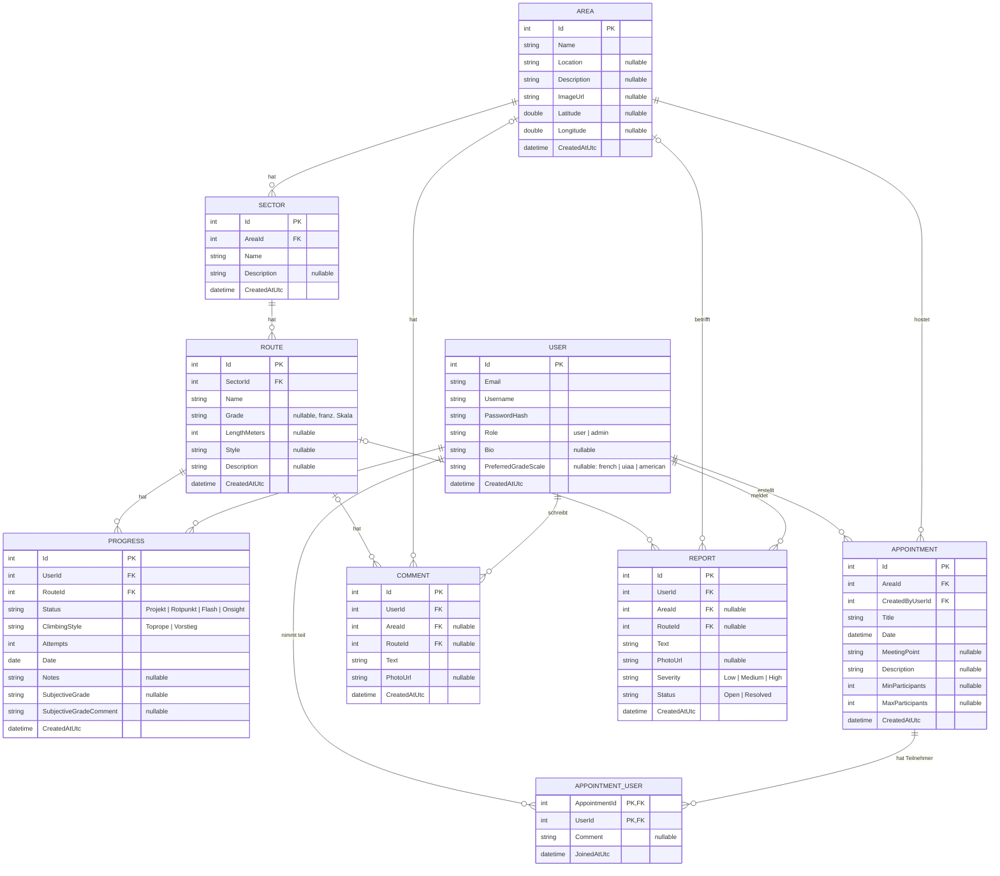

# ER-Diagramm – ClimbConnect (v3)

Datenbank: **SQLite** über EF Core (Code-First, Migrationen in `backend/ClimbConnect.API/Migrations`).
Das Diagramm entspricht den Entity-Klassen in `backend/ClimbConnect.API/Models` (Stand: Oktober 2026).

```mermaid
erDiagram
    USER {
        int Id PK
        string Email
        string Username
        string PasswordHash
        string Role "user | admin"
        string Bio "nullable"
        string PreferredGradeScale "nullable: french | uiaa | american"
        datetime CreatedAtUtc
    }
    AREA {
        int Id PK
        string Name
        string Location "nullable"
        string Description "nullable"
        string ImageUrl "nullable"
        double Latitude "nullable"
        double Longitude "nullable"
        datetime CreatedAtUtc
    }
    SECTOR {
        int Id PK
        int AreaId FK
        string Name
        string Description "nullable"
        datetime CreatedAtUtc
    }
    ROUTE {
        int Id PK
        int SectorId FK
        string Name
        string Grade "nullable, franz. Skala"
        int LengthMeters "nullable"
        string Style "nullable"
        string Description "nullable"
        datetime CreatedAtUtc
    }
    PROGRESS {
        int Id PK
        int UserId FK
        int RouteId FK
        string Status "Projekt | Rotpunkt | Flash | Onsight"
        string ClimbingStyle "Toprope | Vorstieg"
        int Attempts
        date Date
        string Notes "nullable"
        string SubjectiveGrade "nullable"
        string SubjectiveGradeComment "nullable"
        datetime CreatedAtUtc
    }
    APPOINTMENT {
        int Id PK
        int AreaId FK
        int CreatedByUserId FK
        string Title
        datetime Date
        string MeetingPoint "nullable"
        string Description "nullable"
        int MinParticipants "nullable"
        int MaxParticipants "nullable"
        datetime CreatedAtUtc
    }
    APPOINTMENT_USER {
        int AppointmentId PK, FK
        int UserId PK, FK
        string Comment "nullable"
        datetime JoinedAtUtc
    }
    COMMENT {
        int Id PK
        int UserId FK
        int AreaId FK "nullable"
        int RouteId FK "nullable"
        string Text
        string PhotoUrl "nullable"
        datetime CreatedAtUtc
    }
    REPORT {
        int Id PK
        int UserId FK
        int AreaId FK "nullable"
        int RouteId FK "nullable"
        string Text
        string PhotoUrl "nullable"
        string Severity "Low | Medium | High"
        string Status "Open | Resolved"
        datetime CreatedAtUtc
    }

    AREA ||--o{ SECTOR : "hat"
    SECTOR ||--o{ ROUTE : "hat"
    AREA ||--o{ APPOINTMENT : "hostet"
    USER ||--o{ APPOINTMENT : "erstellt"
    APPOINTMENT ||--o{ APPOINTMENT_USER : "hat Teilnehmer"
    USER ||--o{ APPOINTMENT_USER : "nimmt teil"
    USER ||--o{ PROGRESS : "erfasst"
    ROUTE ||--o{ PROGRESS : "hat"
    USER ||--o{ COMMENT : "schreibt"
    AREA |o--o{ COMMENT : "hat"
    ROUTE |o--o{ COMMENT : "hat"
    USER ||--o{ REPORT : "meldet"
    AREA |o--o{ REPORT : "betrifft"
    ROUTE |o--o{ REPORT : "betrifft"
```

## Erläuterungen

| Punkt | Beschreibung |
|---|---|
| **Hierarchie** | `Area` → `Sector` → `Route`. Eine Route gehört immer zu genau einem Sektor. |
| **AppointmentUser** | Zwischentabelle (n:m) zwischen `User` und `Appointment`, zusammengesetzter Primärschlüssel `(AppointmentId, UserId)`. |
| **Comment / Report** | Beziehen sich **entweder** auf ein Gebiet (`AreaId`) **oder** auf eine Route (`RouteId`), daher beide FKs nullable. |
| **Cascade Delete** | Wird ein Gebiet oder eine Route gelöscht, werden zugehörige Kommentare und Meldungen mitgelöscht. |
| **Authentifizierung** | Eigene Benutzerverwaltung: Passwort wird gehasht (`PasswordHash`), Login liefert ein JWT. `Role` steuert Admin-Rechte. |
| **Grade** | Wird intern in französischer Skala gespeichert und bei Bedarf über den `GradeConversionService` in UIAA/amerikanisch umgerechnet (`PreferredGradeScale`). |

## Enums

- **Progress.Status:** `Projekt` · `Rotpunkt` · `Flash` · `Onsight`
- **Progress.ClimbingStyle:** `Toprope` · `Vorstieg`
- **Report.Severity:** `Low` · `Medium` · `High`
- **Report.Status:** `Open` · `Resolved`
- **User.Role:** `user` · `admin`
